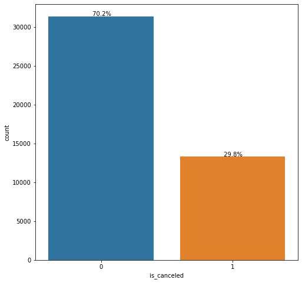
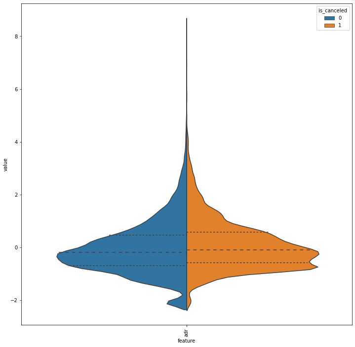
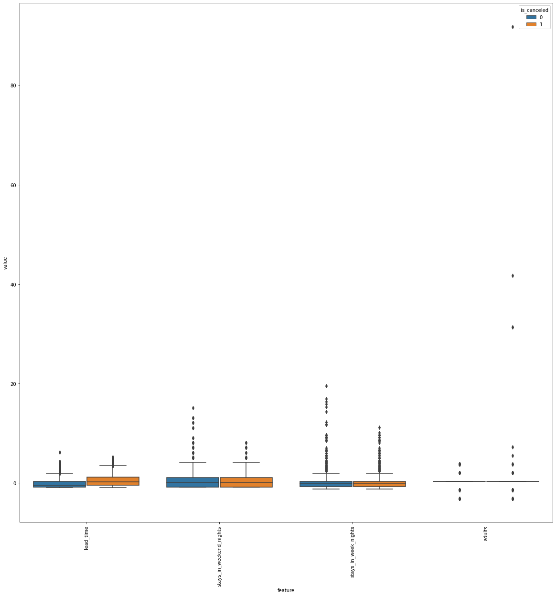
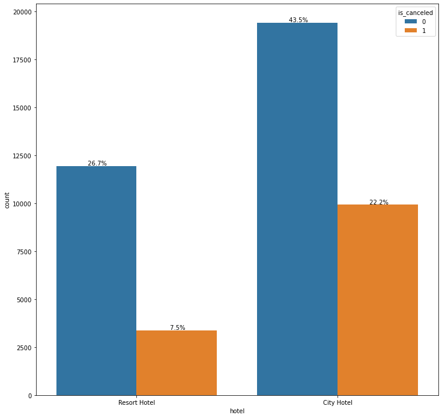
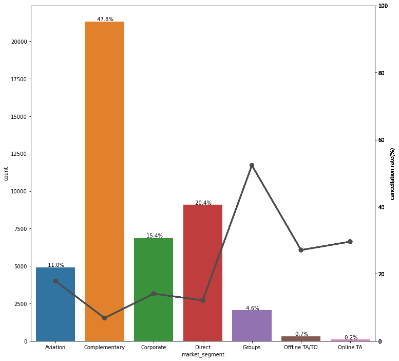
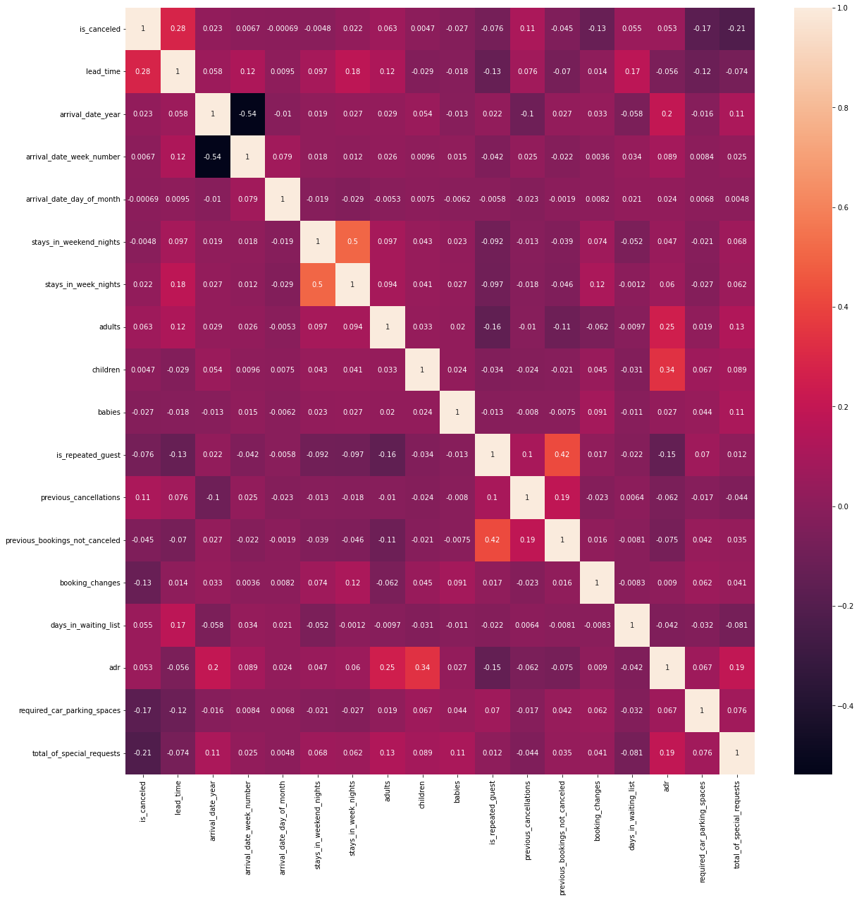
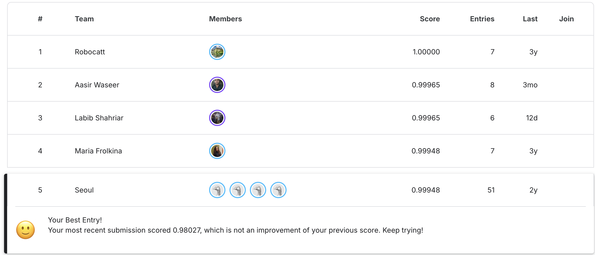

# Hotel Booking Demand

## 프로젝트 개요
본 프로젝트는 Kaggle의 Community Competitions에 참가한 프로젝트로, 호텔 예약 데이터를 기반으로 고객의 예약 취소 여부를 예측하는 프로젝트입니다.

## 프로젝트 수행 과정

### Data description
- 각 feature가 나타내는 의미를 파악하기 위해 data description을 작성했습니다.
  
### EDA
- 고객의 예약 취소 분포를 확인한 결과, 다음과 같이 불균형한 분포를 보였습니다.

- 각 feature를 유형에 따라 다음과 같이 분류했습니다.
  - 수치형 특성(numeric feature)
    - 연속형 데이터(continuous data)
    - 이산형 데이터(discrete data)

  - 범주형 특성(categorical feature)
    - 이진 데이터(binary data)
    - 순서형 데이터(ordinal data)
    - 명목형 데이터(nominal data)

- 예약 취소 여부에 따라 각 feature의 분포를 유형별로 시각화하여, 어떤 feature가 고객의 예약 취소에 영향을 미치는지 파악했습니다.
  - 연속형 데이터의 경우, 예약 취소 여부에 따른 데이터의 분포 차이(평균, 분산, 사분위수)를 비교했습니다.
  
  - 이산형 데이터의 경우, 예약 취소 여부에 따른 데이터의 분포 차이(평균, 신뢰구간)를 비교했습니다.
  
  - 이진 데이터의 경우, feature 값에 따라 예약 취소 분포를 시각화하여 기존의 분포와의 차이를 비교했습니다.
  
  - 순서형 데이터와 명목형 데이터의 경우, feature 값에 따른 예약 취소율을 그래프로 나타내어 전체 데이터셋의 예약 취소율과의 차이를 비교했습니다.
  

### Data Preprocessing
- EDA를 통해 다음 feature들이 고객의 예약 취소 여부에 영향을 미칠 가능성이 크다고 판단했습니다.
  - hotel, lead_time, meal, market_segment, deposit_type, customer_type, total_of_special_requests

- lead_time과 total_of_special_requests feature는 이상치를 제거하기 위해 data cleaning을 진행했습니다.
- 또, 원본 데이터에서 유용한 feature를 추출하기 위해 feature engineering을 진행했습니다. 추출한 feature는 다음과 같습니다.
  - is_checked_out: 고객이 실제로 체크아웃을 했는지를 나타내는 데이터, arrival_date와 reservation_status_date로부터 추출
  - room_changed: 예약한 객실과 실제 배정받은 객실이 일치하는지를 나타내는 데이터, reserved_room_type와 assigned_room_type로부터 추출

- 위 feature들의 상관관계 히트맵을 바탕으로 모델에 사용할 feature들을 선택했습니다.
- 선택된 feature들의 상관관계 히트맵은 다음과 같습니다.

### Modeling
- 예측을 위해 다음 세 가지 모델에 대한 모델링을 진행했습니다.
  - Rule-based Classification(RBC): is_checked_out이 0이면 취소, 1이면 아닌 것으로 예측
  - Logistic Regression(LR): 선택된 feature 개수에 따라 input 노드가 8개인 선형 레이어 구조로 모델 설계
  - Multilayer Perceptron(MLP): Logistic Regression의 모델 구조에서 노드가 4개인 중간 레이어 추가

## 프로젝트 결과
- 평가 데이터셋에서 각 모델의 성능은 다음과 같습니다.

  | model | score |
  |--------|--------|
  | RBC | 0.99744 |
  | LR | 0.99234 |
  | MLP | 0.98027 |
  
- 리더보드 제출 결과, 402팀 중 5위를 기록했습니다.

## 참고문헌
- 신백균. (2022). ***Must Have 머신러닝·딥러닝 문제해결 전략***. 골든래빗(주).